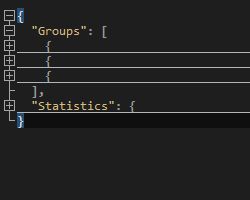
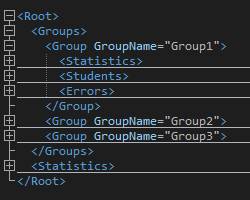

# DataProcessingApplication

`Name:` DataProcessingApplication, `Date:` 2019.09.03, `Project:` Visual studio 2019, `Framework:` 4.7.2, `Program language:` C#, `UI language:` English, `Comments:` English, `Description:` CMD program for generate Xml or Json from specific txt file. (generate all.xml in same place like exe file)

`Powershell script for demonstration how to use DataProcessingApplication` 

```powershell
$pathToExe = "C:\Users\User123\source\repos\29.8.2019_DataProcessingApplication\DataProcessingApplication\bin\Debug\DataProcessingApplication.exe"
$pathToData = "C:\Users\User123\source\repos\29.8.2019_DataProcessingApplication\DataProcessingApplication\examination.txt"
$extension = "Xml" #or json
& $pathToExe $pathToData $extension

```

`Output structure:` 



`Download:`
[Compressed exe file](AdditionalResources/ProgramExe.zip).